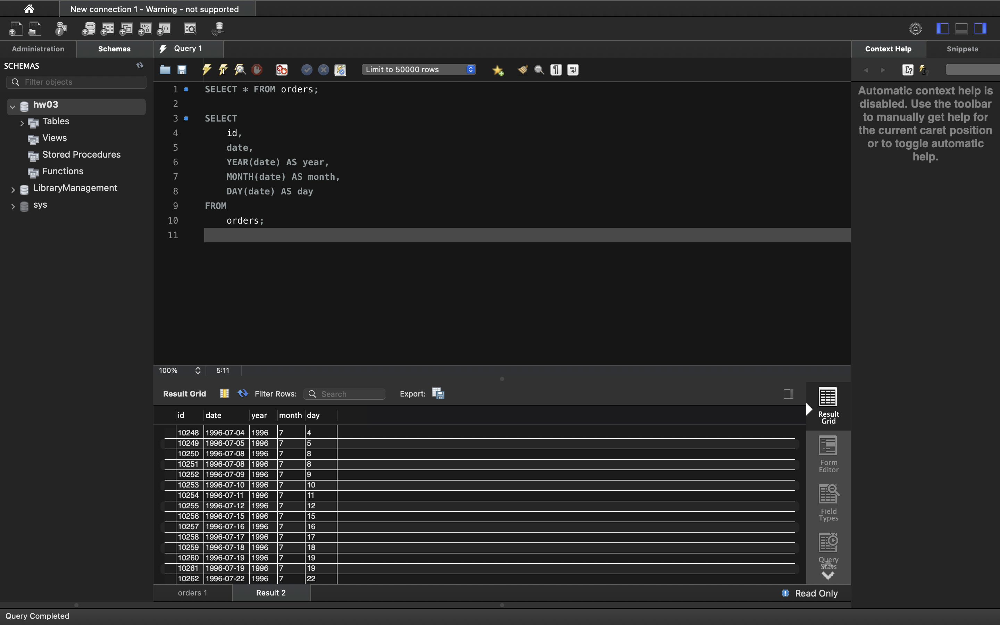
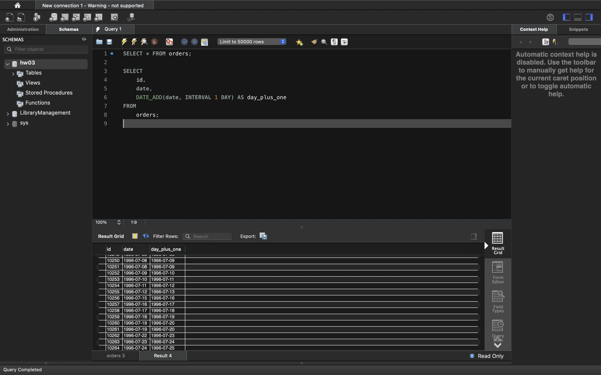
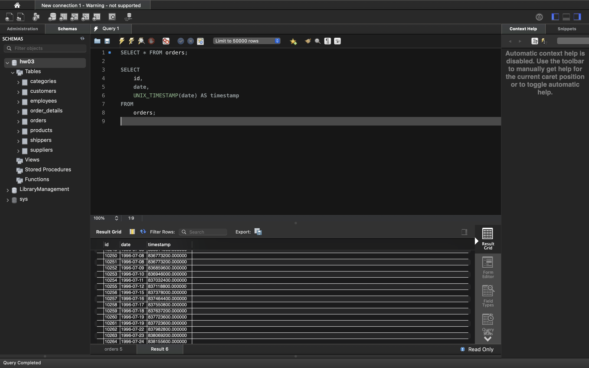
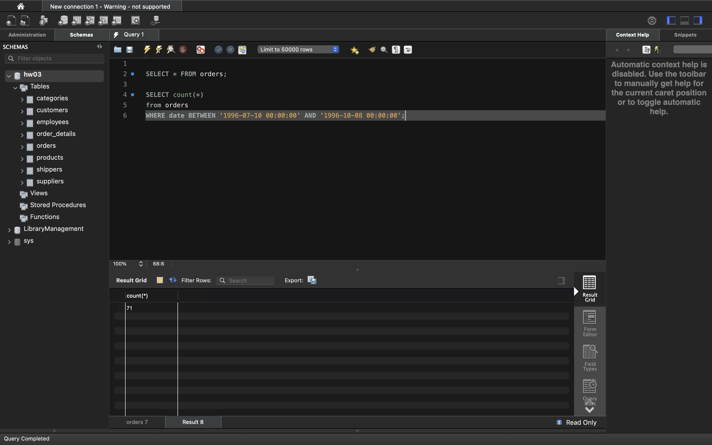
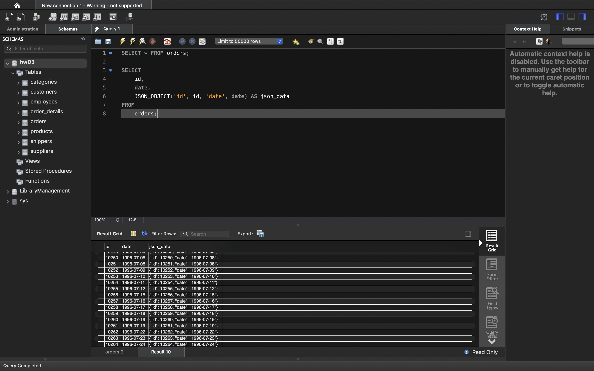

# SQL Commands Overview

This document explains a series of SQL commands used for querying and analyzing data from a database.

## 1. Write an SQL query that for the orders table from the date attribute includes day, month, and day. Display these three attributes next to the id attribute and the original date attribute (there are 5 attributes in total).



```sql
SELECT * FROM orders;

SELECT 
    id, 
    date, 
    YEAR(date) AS year, 
    MONTH(date) AS month, 
    DAY(date) AS day
FROM 
    orders;
```

## 2. Write an SQL query that adds one day to the date attribute for the orders table. Display the id attribute on the screen, the original date attribute and the added result.



```sql
SELECT * FROM orders;

SELECT 
    id, 
    date,  
    DATE_ADD(date, INTERVAL 1 DAY) AS day_plus_one
FROM 
    orders;
```

## 3. Write an SQL query that for the orders table for the date attribute displays the number of seconds per week (shows its timestamp value). Why do you need to know and install the necessary function? Display the id attribute, the original date attribute and the result of the robotic function on the screen.



```sql
SELECT * FROM orders;

SELECT 
    id, 
    date, 
    UNIX_TIMESTAMP(date) AS timestamp
FROM 
    orders;
```

## 4. Write an SQL query that determines how many rows the orders table contains rows with the date attribute between 1996-07-10 00:00:00 and 1996-10-08 00:00:00.



```sql
SELECT * FROM orders;

SELECT count(*)
from orders
WHERE date BETWEEN '1996-07-10 00:00:00' AND '1996-10-08 00:00:00';
```


## 5. Write an SQL query that for the orders table will display the id attribute, the date attribute, and the JSON object {"id": <row id attribute>, "date": <row date attribute>}. To create a JSON object, use the function.



```sql
SELECT * FROM orders;

SELECT 
    id, 
    date,  
    JSON_OBJECT('id', id, 'date', date) AS json_data
FROM 
    orders;
```
